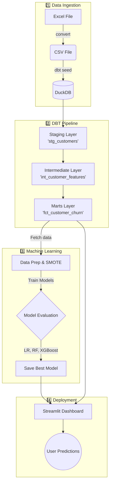
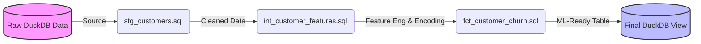

# 📊 Customer Churn Analysis - Modern Data Stack

> Predicting customer churn using **DBT**, **DuckDB**, and **Machine Learning**

[](https://www.python.org/)
[](https://www.getdbt.com/)
[](https://duckdb.org/)
[](LICENSE)

---

## 🎯 Project Overview

This project demonstrates a **modern data engineering approach** to customer churn prediction, combining:
- **DBT** for SQL-based transformations
- **DuckDB** as an analytical database
- **Machine Learning** for churn prediction
- **Automated testing** for data quality

### Why This Approach?

| Traditional | This Project |
|-------------|--------------|
| Pandas scripts | SQL transformations |
| No testing | Automated data quality tests |
| Hard to reproduce | `dbt run` = Done |
| No documentation | Auto-generated docs |
| Manual pipeline | Version-controlled SQL |

---

## 🏗️ Architecture

### 1. Overall Project Architecture



### 2. DBT Data Modeling DAG



---

## 📁 Project Structure

```
customer-churn-dbt/
│
├── 📂 dbt_project/                    # DBT Project
│   ├── 📂 models/
│   │   ├── 📂 staging/               # Layer 1: Data Cleaning
│   │   │   ├── stg_customers.sql     # Clean & rename columns
│   │   │   └── schema.yml            # Tests for staging
│   │   │
│   │   ├── 📂 intermediate/          # Layer 2: Feature Engineering
│   │   │   ├── int_customer_features.sql  # Encode features
│   │   │   └── schema.yml            # Tests for features
│   │   │
│   │   └── 📂 marts/                 # Layer 3: Final Dataset
│   │       ├── fct_customer_churn.sql     # ML-ready table
│   │       └── schema.yml            # Tests for final data
│   │
│   ├── 📂 seeds/                     # Raw Data
│   │   ├── Telco_customer_churn.csv  # Input data
│   │   └── properties.yml            # Seed configurations
│   │
│   ├── 📂 tests/                     # Custom tests (if any)
│   ├── 📄 dbt_project.yml            # DBT configuration
│   └── 📄 profiles.yml               # Database connection
│
├── 📂 data/
│   ├── Telco_customer_churn.xlsx     # Original Excel file
│   └── churn.duckdb                  # DuckDB database
│
├── 📂 src/
│   ├── convert_excel_to_csv.py       # Excel → CSV converter
│   └── train_model.py                # ML training script
│
├── 📂 models/                        # Trained ML Models
│   ├── logistic_regression_model.pkl
│   ├── random_forest_model.pkl
│   ├── xgboost_model.pkl
│   ├── scaler.pkl                    # Feature scaler
│   ├── encoded_columns.pkl           # Column names after encoding
│   ├── input_template.pkl            # Template for predictions
│   └── feature_names.txt             # Feature list
│
├── 📂 app/
│   └── streamlit_app.py              # Prediction dashboard
│
├── 📂 notebooks/
│   └── 01_explore_duckdb.ipynb       # Data exploration
│
├── 📄 requirements.txt               # Python dependencies
├── 📄 README.md                      # This file
├── 📄 DEMO_PRESENTATION.md           # Presentation slides
└── 📄 .gitignore

```

---

## 🚀 Quick Start

### Prerequisites

- Python 3.12+
- Git

### Installation

```bash
# 1. Clone repository
git clone <your-repo-url>
cd customer-churn-dbt

# 2. Install dependencies
pip install -r requirements.txt

# 3. Convert Excel to CSV
python src/convert_excel_to_csv.py

# 4. Run DBT pipeline
cd dbt_project
dbt seed          # Load data into DuckDB
dbt run           # Run transformations
dbt test          # Run data quality tests

# 5. Train ML models
cd ..
python src/train_model.py

# 6. Launch dashboard
streamlit run app/streamlit_app.py --server.port 8501 --server.address 0.0.0.0
```

---

## 🔄 DBT Pipeline Details

### Layer 1: Staging

**File:** `models/staging/stg_customers.sql`

**Purpose:** Clean and standardize raw data

```sql
SELECT 
    "customerID" as customer_id,
    "Gender" as gender,
    "Senior Citizen" as is_senior_citizen,
    "Tenure Months" as tenure_months,
    ...
FROM {{ ref('Telco_customer_churn') }}
```

**Output:** View with clean column names

---

### Layer 2: Intermediate

**File:** `models/intermediate/int_customer_features.sql`

**Purpose:** Feature engineering and encoding

```sql
SELECT
    customer_id,
    -- Encode categorical variables
    CASE WHEN gender = 'Male' THEN 1 ELSE 0 END as gender_encoded,
    CASE 
        WHEN contract_type = 'Two year' THEN 2
        WHEN contract_type = 'One year' THEN 1
        ELSE 0 
    END as contract_encoded,
    ...
FROM {{ ref('stg_customers') }}
```

**Output:** View with encoded features

---

### Layer 3: Marts

**File:** `models/marts/fct_customer_churn.sql`

**Purpose:** Final production dataset

```sql
{{ config(materialized='table') }}

SELECT * 
FROM {{ ref('int_customer_features') }}
WHERE customer_id IS NOT NULL
```

**Output:** Physical table ready for ML (7,043 rows × 28 features)

---

## 🧪 Data Quality Testing

DBT automatically tests your data:

```yaml
# models/marts/schema.yml
models:
  - name: fct_customer_churn
    columns:
      - name: customer_id
        tests:
          - unique          # No duplicate IDs
          - not_null        # No missing IDs
      
      - name: Churn Label
        tests:
          - not_null        # No missing labels
          - accepted_values:
              values: [0, 1] # Only 0 or 1
```

**Run tests:**
```bash
cd dbt_project
dbt test
```

---

## 🤖 Machine Learning

### Models Trained

1. **Logistic Regression** (Baseline)
2. **Random Forest** (Best F1-Score)
3. **XGBoost** (Best ROC-AUC)

### Pipeline Steps

```python
# 1. Load from DuckDB
conn = duckdb.connect('data/churn.duckdb')
df = conn.execute("SELECT * FROM marts.fct_customer_churn").df()

# 2. Handle class imbalance
smote = SMOTE(random_state=42)
X_balanced, y_balanced = smote.fit_resample(X_train, y_train)

# 3. Scale features
scaler = StandardScaler()
X_scaled = scaler.fit_transform(X_balanced)

# 4. Train models
model.fit(X_scaled, y_balanced)

# 5. Evaluate
f1 = f1_score(y_test, y_pred)
auc = roc_auc_score(y_test, y_pred_proba)
```

### Results

| Model | Accuracy | F1-Score | ROC-AUC |
|-------|----------|----------|---------|
| Logistic Regression | 0.72 | 0.44 | 0.70 |
| **Random Forest** | **0.75** | **0.62** | **0.83** |
| XGBoost | 0.77 | 0.60 | 0.84 |

**Best Model:** Random Forest (F1=0.62, ROC-AUC=0.83)

---

## 📊 Key Features (Top 10)

1. **Tenure Months** (12.3%) - How long customer has been with company
2. **Monthly Charges** (10.1%) - Monthly bill amount
3. **Contract Type** (8.7%) - Month-to-month vs long-term
4. **Total Charges** (7.5%) - Total amount paid
5. **Internet Service** (6.8%) - DSL vs Fiber vs No internet
6. **Tech Support** (5.9%) - Has tech support or not
7. **Payment Method** (5.2%) - How customer pays
8. **Online Security** (4.8%) - Has online security addon
9. **Paperless Billing** (4.3%) - Paperless or paper bills
10. **CLTV** (3.9%) - Customer Lifetime Value

---

## 💼 Business Impact

### Retention Strategy

| Risk Level | Churn Probability | Actions | Budget | Timeline |
|------------|-------------------|---------|--------|----------|
| 🚨 High | > 70% | • 20-30% discount<br>• Dedicated account manager<br>• Emergency intervention | 30% ACV | 48 hours |
| ⚠️ Medium | 40-70% | • 10-15% retention offer<br>• Satisfaction survey<br>• Feature training | 15% ACV | 1-2 weeks |
| ✅ Low | < 40% | • Loyalty rewards<br>• Upsell opportunities<br>• Referral program | 5-10% ACV | Ongoing |

### ROI Projection

**Assumptions:**
- 1,000 customers
- $10,000 average annual revenue per customer
- 20% current churn rate
- 30% reduction in churn with intervention

**Investment:** $270,000/year  
**Retained Revenue:** $1,500,000/year  
**ROI:** **456%** 🎉

---

## 🛠️ Common Commands

### DBT Commands

```bash
cd dbt_project

# Run all models
dbt run

# Run specific model
dbt run --select stg_customers

# Run model and all downstream models
dbt run --select stg_customers+

# Test data quality
dbt test

# Generate documentation
dbt docs generate
dbt docs serve

# Clean build artifacts
dbt clean
```

### Python Commands

```bash
# Convert Excel to CSV
python src/convert_excel_to_csv.py

# Train models
python src/train_model.py

# Launch dashboard
streamlit run app/streamlit_app.py
```

---

## 📚 Learning Resources

### DBT
- [DBT Learn (Free Course)](https://courses.getdbt.com/)
- [DBT Documentation](https://docs.getdbt.com/)
- [DBT Best Practices](https://docs.getdbt.com/guides/best-practices)

### DuckDB
- [DuckDB Documentation](https://duckdb.org/docs/)
- [DuckDB Python API](https://duckdb.org/docs/api/python/overview)

### Machine Learning
- [Scikit-learn Documentation](https://scikit-learn.org/)
- [XGBoost Documentation](https://xgboost.readthedocs.io/)
- [Handling Imbalanced Data](https://imbalanced-learn.org/)

---

## 🐛 Troubleshooting

### DuckDB Installation Issues

```bash
pip install --upgrade pip
pip install duckdb
```

### DBT Seed Errors

If you get errors with `Total Charges`:
```bash
# Re-run the conversion script (it handles missing values)
python src/convert_excel_to_csv.py
cd dbt_project
dbt seed --full-refresh
```

### Model Training Errors

```bash
# Make sure DBT pipeline ran successfully
cd dbt_project
dbt run

# Check data exists in DuckDB
duckdb ../data/churn.duckdb
> SELECT COUNT(*) FROM marts.fct_customer_churn;
> .quit

# Then train
cd ..
python src/train_model.py
```

---

## 🎯 Key Takeaways

### What Makes This Project Different?

1. **SQL-First Approach**
   - All transformations in SQL (not Python)
   - Easy to understand and modify
   - Version controlled in Git

2. **Automated Testing**
   - Data quality tests run automatically
   - Catch issues before they reach ML models

3. **Reproducible**
   - `dbt run` = Entire pipeline
   - No manual steps
   - Same results every time

4. **Production-Ready**
   - Documented code
   - Tested data
   - Scalable architecture

---

## 📈 Future Enhancements

- [ ] Deploy dashboard to cloud (Streamlit Cloud)
- [ ] Add CI/CD pipeline (GitHub Actions)
- [ ] Implement incremental models in DBT
- [ ] Create REST API for predictions
- [ ] Add model monitoring and drift detection
- [ ] Integrate with production database (Snowflake/BigQuery)
- [ ] Build customer segmentation model
- [ ] Add A/B testing framework

---

## 📝 License

MIT License - See [LICENSE](LICENSE) file for details

---

## 🙏 Acknowledgments

- **Dataset:** Kaggle Telco Customer Churn Dataset
- **Tools:** DBT, DuckDB, Scikit-learn, XGBoost, Streamlit
- **Inspiration:** Modern Data Stack principles

---

## 📞 Contact

- **GitHub:** [Your GitHub Profile]
- **LinkedIn:** [Your LinkedIn]
- **Email:** [Your Email]

---

**⭐ If you found this project helpful, please give it a star!**

---

*Built with ❤️ using DBT, DuckDB, and Python*